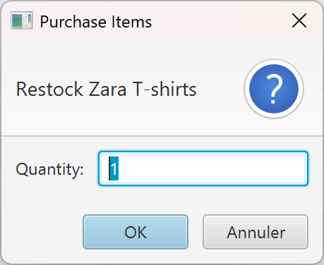
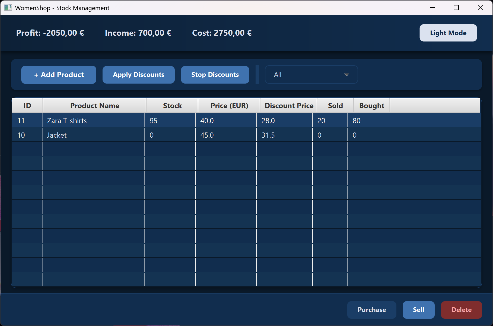
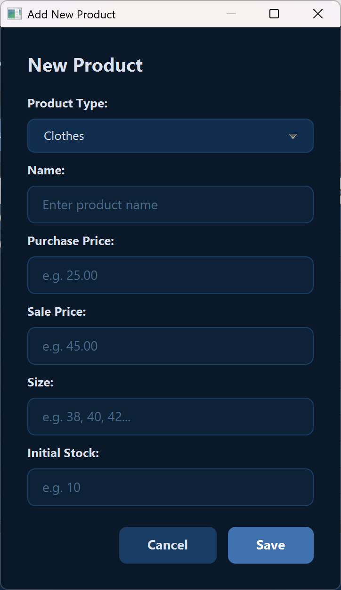
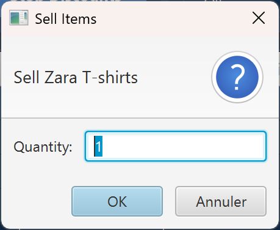

# WomenShop - Store Inventory Management System

A desktop application built with JavaFX for managing a women's fashion store. Track your inventory of clothes, shoes, and accessories — buy stock, sell products, apply discounts, and monitor your finances in real time.

---

## Features

- **Product Management** — Add, delete, and browse products across 3 categories: Clothes, Shoes, and Accessories
- **Buy & Sell** — Purchase stock from suppliers and sell to customers, with automatic financial tracking
- **Custom Discounts** — Apply a custom discount % on individual products, with category-based limits (Clothes max 30%, Shoes max 20%, Accessories max 50%)
- **Financial Dashboard** — Live profit, income, and cost displayed at the top of the screen
- **Category Filter** — Filter the product table by Clothes, Shoes, Accessories, or show all
- **Dark / Light Mode** — Toggle between two themes with one click
- **Persistent Data** — All data is stored in an Oracle database, so nothing is lost between sessions

---

## Screenshots

### Light Mode


| Purchase Dialog | Sell Dialog |
|---|---|
|  |  |

### Dark Mode





| Purchase Dialog | Sell Dialog |
|---|---|
|  |  |

---

## Tech Stack

| Technology | Version |
|---|---|
| Java | 21 |
| JavaFX | 17.0.2 |
| Oracle Database XE | 21c |
| Maven | 3.x |
| JDBC (ojdbc8) | 19.3.0.0 |

---

## Prerequisites

Before running the application, make sure you have:

1. **Java 21** (or higher) installed — [Download](https://www.oracle.com/java/technologies/downloads/)
2. **Maven** installed — [Download](https://maven.apache.org/download.cgi)
3. **Oracle XE 21c** running (recommended via Docker)

---

## Database Setup

### Option 1: Docker (Recommended)

Pull and run Oracle XE in a Docker container:

```bash
docker run -d --name oracle-xe \
  -p 1521:1521 \
  -e ORACLE_PASSWORD=admin \
  gvenzl/oracle-xe:21.3.0-slim
```

Wait a couple of minutes for Oracle to fully start, then verify:

```bash
docker logs oracle-xe
```

Look for: `DATABASE IS READY TO USE!`

### Option 2: Local Oracle Installation

If you have Oracle installed locally, make sure it's running on `localhost:1521` with the pluggable database `XEPDB1`.

### Database Connection

The app connects with these default credentials (in `DBConnection.java`):

| Property | Value |
|---|---|
| URL | `jdbc:oracle:thin:@localhost:1521/XEPDB1` |
| User | `system` |
| Password | `admin` |

> If your Oracle setup uses different credentials, update them in:
> `src/main/java/com/womenshop/dao/DBConnection.java`

### Auto Table Creation

You do **not** need to create tables manually. The application automatically creates all required tables on startup:

- `products` — Main product table (name, prices, stock, category)
- `clothes` — Size attribute for clothing products
- `shoes` — Shoe size attribute for shoe products
- `store_finances` — Tracks total income and costs

---

## How to Run

1. **Clone the repository:**
   ```bash
   git clone https://github.com/matinebdi/WomenSho.git
   cd WomenSho
   ```

2. **Make sure Oracle DB is running** (see Database Setup above)

3. **Run the application:**
   ```bash
   mvn clean javafx:run
   ```

The application window will open and you're ready to go.

---

## How to Use

### Adding a Product

1. Click **"+ Add Product"** in the toolbar
2. Fill in the product name, purchase price, sell price, and initial stock quantity
3. Select a category (Clothes, Shoes, or Accessory)
4. For Clothes: enter a size (36, 38, 40, etc.)
5. For Shoes: enter a shoe size (36–46)
6. Click **Save**

### Selling a Product

1. Select a product in the table
2. Click **"Sell"** at the bottom
3. Enter the quantity to sell
4. The stock decreases and income is updated

### Purchasing / Restocking

1. Select a product in the table
2. Click **"Purchase"** at the bottom
3. Enter the quantity to buy
4. The stock increases and cost is updated

### Applying a Discount

1. Select a product in the table
2. Click **"Apply Discounts"** in the toolbar
3. Enter the discount percentage you want to apply
4. Each category has a maximum discount limit:
   - Clothes: max **30%**
   - Shoes: max **20%**
   - Accessories: max **50%**
5. To remove the discount, select the product and click **"Stop Discounts"**

### Deleting a Product

1. Select a product in the table
2. Click **"Delete"** at the bottom
3. Note: you can only delete products with **0 stock**

### Filtering by Category

Use the dropdown in the toolbar to filter products by **Clothes**, **Shoes**, **Accessories**, or show **All**.

### Switching Theme

Click the **"Dark Mode"** / **"Light Mode"** button in the top-right corner.

---

## Project Structure

```
WomenShop/
├── pom.xml                          # Maven configuration
├── src/main/java/com/womenshop/
│   ├── MainApp.java                 # Application entry point
│   ├── controller/
│   │   ├── MainController.java      # Main window logic
│   │   └── ProductDialogController.java  # Add product dialog logic
│   ├── dao/
│   │   ├── DBConnection.java        # Database connection config
│   │   ├── DatabaseInitializer.java # Auto table creation
│   │   ├── ProductDAO.java          # Product CRUD operations
│   │   └── FinanceDAO.java          # Finance read/write
│   ├── model/
│   │   ├── Product.java             # Abstract base product class
│   │   ├── Clothes.java             # Clothes subclass
│   │   ├── Shoes.java               # Shoes subclass
│   │   ├── Accessory.java           # Accessory subclass
│   │   └── Discount.java            # Discount interface
│   └── util/
│       └── AlertHelper.java         # Alert dialog utility
├── src/main/resources/
│   ├── fxml/
│   │   ├── main_view.fxml           # Main window layout
│   │   └── product_dialog.fxml      # Add product dialog layout
│   └── css/
│       ├── style.css                # Light theme
│       └── style-dark.css           # Dark theme
└── .gitignore
```

---

## Architecture

The project follows the **MVC (Model-View-Controller)** pattern:

- **Model** — `Product` (abstract), `Clothes`, `Shoes`, `Accessory` with polymorphism and a `Discount` interface
- **View** — FXML files define the UI layout, CSS files handle styling
- **Controller** — JavaFX controllers handle user interaction and connect the UI to the data layer
- **DAO** — Data Access Objects handle all database communication using JDBC

---

## Color Palette

| Color | Hex | Usage |
|---|---|---|
| Snow White | `#F9F7F7` | Background |
| Soft Blue | `#DBE2EF` | Cards, table rows |
| Ocean Blue | `#3F72AF` | Buttons, accents |
| Dark Navy | `#112D4E` | Text, headers |
